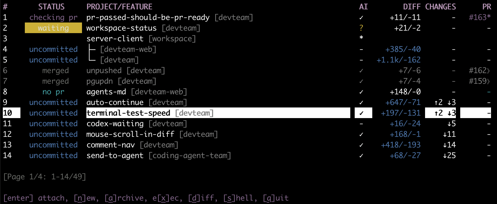

# DevTeam CLI (@agent-era/devteam)

Run a team of local coding agents in your terminal. Launch multiple Claude Code, Codex or Gemini agents, switch between them, review their changes and add comments, and push PRs  all from one streamlined terminal UI. An exercise to push how fast development can happen with multiple parallel agents. Mostly vibe-coded



## Install

Prerequisites: Node.js 18+ and tmux installed and on your PATH

Global install:

```
npm i -g @agent-era/devteam
```

This installs the `devteam` command.

Or run the provided installer script from a clone of this repo:

```
./install.sh
```

## Usage

Run the TUI in the top-level directory that you keep your git projects in:

```
cd ~/projects
devteam
```

Or point it at a directory explicitly:

```
devteam --dir /path/to/projects
# or
PROJECTS_DIR=/path/to/projects devteam
```
For best results:
- run in a VM and give your agents broad permissions within that sandbox
- give them a dedicated GitHub account that they can use to create PRs automatically
- add some guidelines in CLAUDE.md / AGENTS.md to add tests and make a PR for each feature

## Features

Use DevTeam to manage a team of agents working in parallel on your projects:

- Kick off multiple agents working on features in parallel (uses git worktrees)
- See their code changes with a built-in diff viewer, and add comments that are sent to them to address
- Agents asking for your input are highlighted in the UI so you can unblock them
- See how far each agent is: diff line counts, whether the feature is pushed, GitHub PR checks and status
- Run your program or server in each worktree so you can try out the changes easily.
- Choose Claude Code, Codex or Gemini CLI to work on each feature

## Repository

- GitHub: https://github.com/agent-era/devteam
- Issues: https://github.com/agent-era/devteam/issues

## Development

- Build: `npm run build`
- Run: `npm run cli -- --dir <path_to_projects_root>`
- Test: `npm test`
- Terminal E2E tests: `npm run test:terminal`

## Sync Server (Local Mode)

For local development without a relay, a tiny WebSocket sync server exposes basic state. Right now it serves a worktree list snapshot and pushes periodic refreshes.

- Start the sync server:

```
PROJECTS_DIR=/path/to/projects npx devteam-server
# Defaults: ws://127.0.0.1:8787/sync
# Env overrides: SYNC_HOST, SYNC_PORT, SYNC_PATH, SYNC_REFRESH_MS
```

- Connect from Node or the browser:

```ts
import {SyncClient} from '@agent-era/devteam/sync';

const c = new SyncClient({url: 'ws://127.0.0.1:8787/sync', autoSubscribe: true});
c.on('worktrees', (items, version) => console.log(version, items));
c.connect();
```

## Publishing (scoped public)

```
npm version <patch|minor|major>
npm publish --access public
```

Note: `prepublishOnly` runs the build to ensure `dist/` is included in the published tarball.

Convenience scripts:

```
npm run release:patch  # bump patch + publish
npm run release:minor  # bump minor + publish
npm run release:major  # bump major + publish
```
